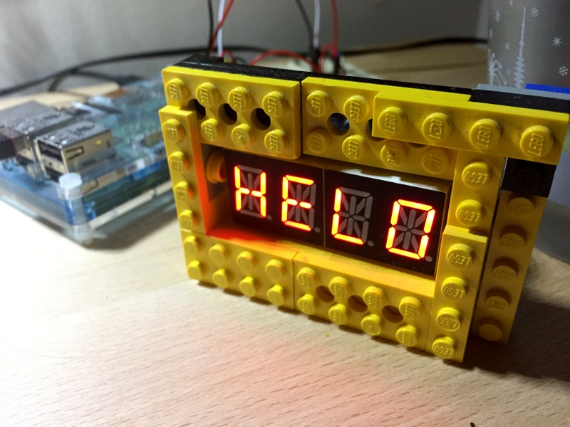

# I2C::AlphaDisplay

A command line gem to make it easy to send data to I2C 7 and 14-segment displays, like this one: https://www.adafruit.com/product/881

## Installation

    $ gem install i2c-alpha_display

## Usage

After installing the gem pipe any output to `i2cdisp` and it will do its best to show it on the display. Numberic input will have suffixes added so as much fits as possible. Eg. `12345` => `12.3k`

    $ echo helo | i2cdisp

## License

The gem is available as open source under the terms of the [MIT License](http://opensource.org/licenses/MIT).

